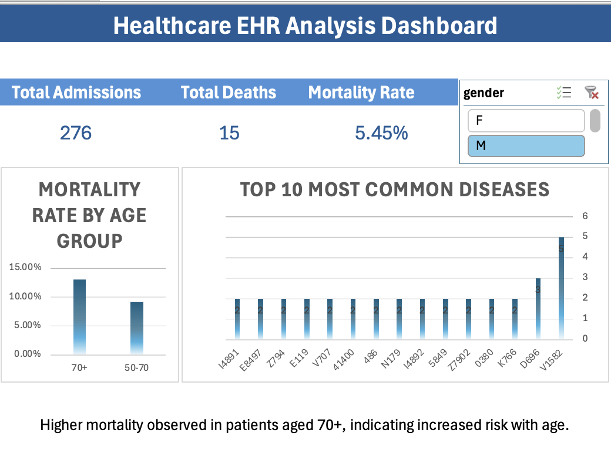

# Healthcare EHR Data Analysis (SQL and Excel Dashboard)

## Project Overview

This project analyzes Electronic Health Records (EHR) data to uncover insights into patient demographics, mortality patterns, and disease trends. The analysis combines advanced SQL techniques with an interactive Excel dashboard to deliver meaningful business insights.

---

## Tools and Technologies

* SQL (CTEs, Window Functions, Joins, Aggregations)
* Microsoft Excel (Pivot Tables, XLOOKUP, Slicers, Dashboard Design)
* Data Analysis and Visualization

---

## Dataset

The dataset consists of three core tables:

* patients.csv
* admissions.csv
* diagnoses_icd.csv

---

## Dashboard Preview



---

## SQL Analysis

The SQL analysis includes:

* Data validation and record counts
* Demographic analysis by gender
* Mortality rate calculations
* Age-based segmentation using CASE statements
* Common Table Expressions (CTEs)
* Window functions such as RANK and LAG
* Top 10 most frequent diseases
* High-risk disease identification
* Patient-level analysis
* Length of stay calculation
* Time-series analysis
* Readmission analysis (30 days)
* Disease contribution percentage

---

## Excel Dashboard

The Excel dashboard includes:

* KPI Metrics:

  * Total Admissions
  * Total Deaths
  * Mortality Rate

* Visualizations:

  * Mortality Rate by Age Group
  * Top 10 Most Common Diseases

* Features:

  * Pivot Tables
  * Slicers (Gender filter)
  * XLOOKUP
  * Structured Tables

---

## Business Questions Answered

* What is the overall mortality rate?
* How does mortality vary by age group?
* Which diseases are most common?
* Which diseases have higher mortality risk?
* How do readmissions impact outcomes?

---

## Key Insights

* Patients aged 70+ show the highest mortality rate
* Patients aged 50–70 also have elevated risk
* A small number of diseases contribute significantly to cases
* Certain diseases are associated with higher mortality
* Readmissions within 30 days impact outcomes

---

## Project Structure

```
ehr-sql-analysis/
│
├── data/              Raw datasets (CSV files)
├── sql/               SQL queries for analysis
├── excel/             Excel dashboard
├── images/            Dashboard screenshots
├── README.md
└── .gitignore
```

---

## How to Run

### SQL Analysis

1. Load CSV files into a SQL environment
2. Run queries from:
   sql/analysis.sql

### Excel Dashboard

1. Open:
   excel/dashboard.xlsx
2. Use slicers to explore the dashboard

---

## Skills Demonstrated

* Advanced SQL querying
* Data transformation and aggregation
* Excel dashboard development
* Data visualization
* Business insight generation

---

## Author

Varsha Ponnaganti
